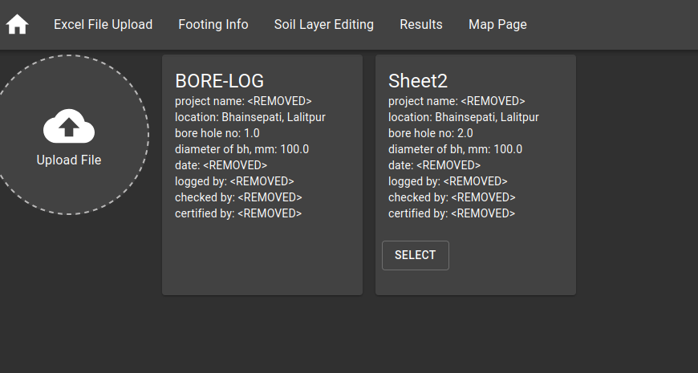
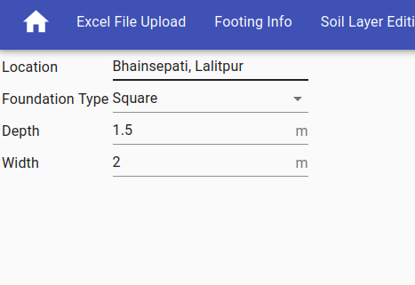
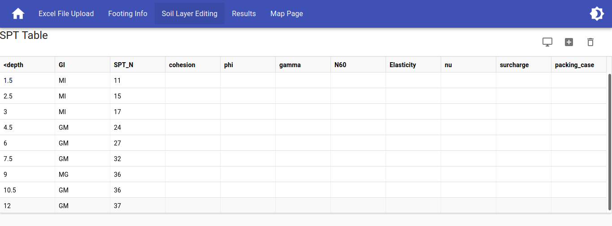
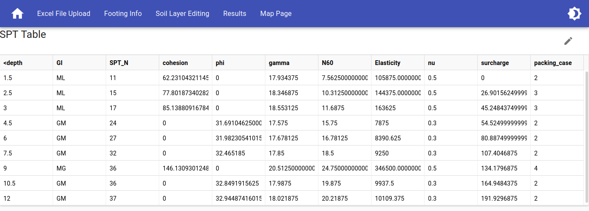
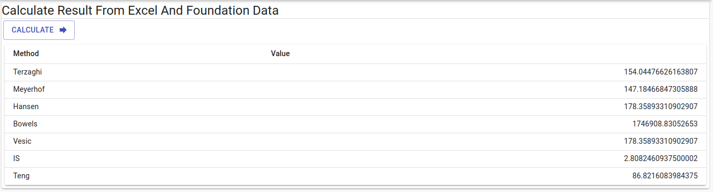
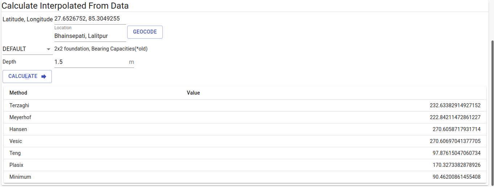
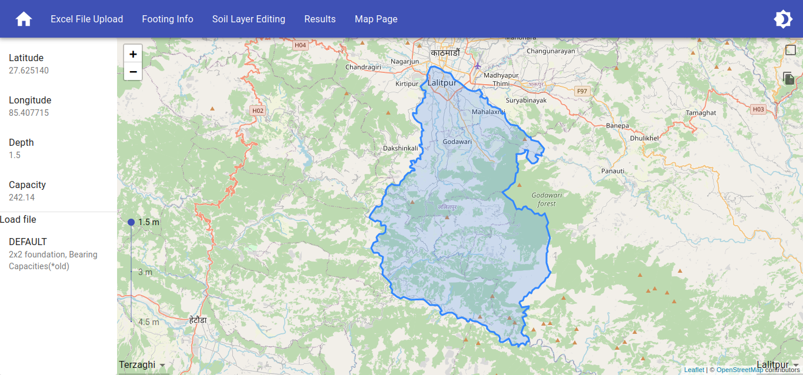

BLCalc
==========
#### [Click to preview](http://ec2-3-90-239-190.compute-1.amazonaws.com)
This is the program to calculate bearing capacity directly from Excel Sheets(containing SPT datas).

More Details
==========
This program takes SPT borehole data(excel sheet) and compute BC(Bearing Capacity) using various methods. Those include, by shear criteria, deflection criteria and outputs that can be used by external programs. This includes libray, some scripts, jupyter notebooks (sample calculation and other information), program with UI(for easy access), django server.

For documentation the notebooks are supposed to provide use cases and they may be used for test cases too.

Program Tabs, screenshots and info
==========
Program has theme selection, so screenshots are diffrents.
### Start Screen

General info about program

### Upload Tab

Upload the excel file. (either .xls, or .xlsx)
If more than one sheet is available in file then sheet selection option.
> Click and select, or
> drag and drop

### Footing info Tab

Basic footing info,
* Water depth not available for now

### Edit Tab
There are 2 modes:-
##### Edit Mode

Actual editing

##### Preview Mode

See program internal interpolations, etc. 

### Results Tab
There are 2 options:-
##### From datas as above

Calculation as per above datas.

##### Calculate from Interpolation

Datas interpolated by IDW from the project report datas.
Geocode from name, to get latitude and longitude.

### Map Tab

Map from datas computed by interpolation.
